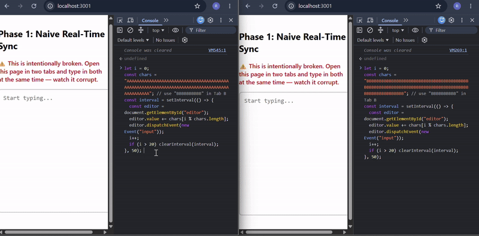

# Architecture & Design Decisions

## Phase 1: The Problem — Naive Last-Write-Wins Sync

### What it does
A minimal Express + Socket.io server broadcasts the *entire* text content
on every keystroke. Any connected client that receives an update simply
overwrites its local state with whatever arrived last.

### Why it breaks
This is a **last-write-wins** strategy applied to a shared mutable string.
It has no concept of individual operations (insert/delete at a position),
no causal ordering, and no way to detect that two clients edited
concurrently. When two clients send updates close together, whichever
update the server processes/broadcasts last simply overwrites the other —
silently. There's no error, no conflict indicator — the earlier client's
edit just disappears.

### Reproducing the bug
Two browser tabs connected to the same document, both firing rapid
`input` events (simulated via a scripted `setInterval` loop to remove
human reaction-time slack and reliably trigger the race):



**Observed failure:** [fill this in with your exact observation —
e.g. "Tab B's inserted characters were silently overwritten by Tab A's
stale snapshot; no error was raised, and the data loss was invisible to
both users."]

### Why this matters beyond a demo
This is the same class of bug that caused real, documented issues in
early collaborative editors before CRDT/OT algorithms were adopted.
Silent data loss under concurrent writes is a correctness bug, not
just a UX glitch — in a production system this could mean a user's
work vanishing with no recovery path.

---

## Phase 2: The Fix — CRDT-Based Convergence (Yjs)

### Why CRDTs over Operational Transformation
[You'll fill this in after reading the Figma blog post — summarize the
tradeoff in your own words: OT requires a central server to transform
operations in the correct order and is notoriously hard to implement
correctly; CRDTs guarantee convergence through math (commutativity,
associativity, idempotency of merges) without needing a central
arbiter, at the cost of some memory overhead from tombstones.]

### Proof of convergence
Before wiring up any server or UI, I validated the core sync mechanism
headlessly: two independent `Y.Doc` instances, concurrent unsynced
edits at the same position, then a manual bidirectional merge.

### Test output

```
Before merge (each peer has diverged)
A (local view): Hello World
B (local view): Hello There

After merge
A (final): Hello ThereWorld
B (final): Hello ThereWorld

Convergence check
A === B: true
```

### What this proves
Both peers independently inserted different text at the same position
(`"World"` and `"There"`) without knowing about each other's edit. After
exchanging updates and merging — with no central server deciding a
winner — both peers converged to an **identical final state**, and
**neither insertion was lost**. Yjs resolves the ordering deterministically
based on each character's internal ID (client ID + logical clock), not
by arrival time — meaning the same two concurrent edits will always
merge to the same result, on any peer, regardless of network timing.

This is the fundamental difference from Phase 1: naive sync *loses data*
under concurrency; CRDT sync *preserves all data* and *guarantees*
identical convergence across all peers.